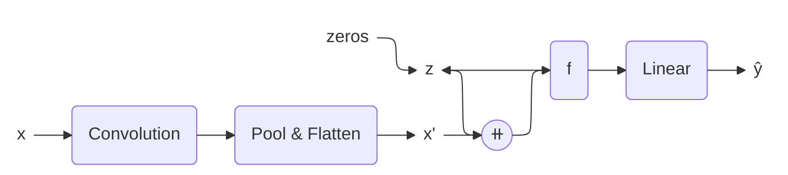

# Recurrent Classifier Sonification

## About

I use parameter-mapping sonification to convert the inner workings of a neural network to sound. This classifier network improves its guesses in a recurrent way, which allows the hidden state to be mapped to the time dimension in the form of a wave file. 

This is a preliminary proof-of-concept for a larger project in partnership with Building 21 at McGill University, where I hope to apply similar techniques to medium-sized language models. 

## Technical Details
### Network

I use the following classifier network, trained on FashionMNIST: 

The model is built and trained using [PyTorch](https://github.com/pytorch/pytorch). This type of network is particularly convenient to start with because 1) it has a small number of hidden states and 2) the recurrent process maps naturally to the time dimension in sound. 

### Sound

The sound is generated by mapping hidden state values to sound frequencies. I am still experimenting with the exact normalization method, but higher notes generally indicate larger numerical values. I use [NumPy](https://numpy.org/) to generate the waveforms and [SciPy](https://scipy.org/) to create the raw `.wav` files. 
