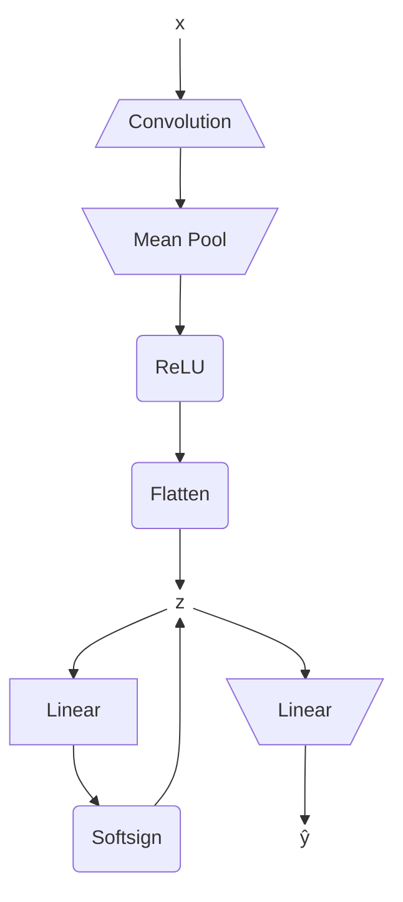

# recurrent-classifier-sonification

```mermaid
flowchart TD;
    X((x))-->C[/Convolution\]-->M[\Mean Pool/]-->R(ReLU)-->F(Flatten)-->Z((z));
    Z-->Linear-->S(Softsign)-->Z;
    Z-->O[\Linear/]-->Y((ŷ));
    style X fill: none, stroke: none
    style Y fill: none, stroke: none
    style Z fill: none, stroke: none
```
