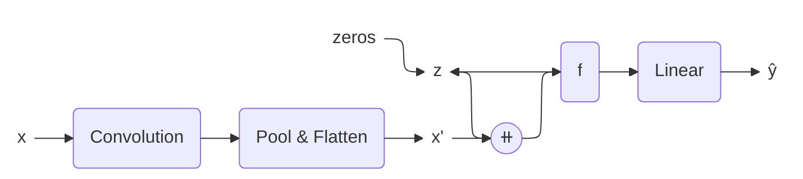

# recurrent-classifier-sonification

```mermaid
---
config:
    layout: elk
    elk:
        mergeEdges: true
        nodePlacementStrategy: NETWORK_SIMPLEX
---
flowchart LR;
    0((zeros)) --> Z((z))
    X((x))-->C(Convolution)-->S(Pool & Flatten)-->X'((x'))-->P((⧺));
    Z-->P
    P-->F(f)-->Z;
    F-->O(Linear)-->Y((ŷ));
    style X fill: none, stroke: none
    style X' fill: none, stroke: none
    style Y fill: none, stroke: none
    style Z fill: none, stroke: none
    style 0 fill: none, stroke: none
```
