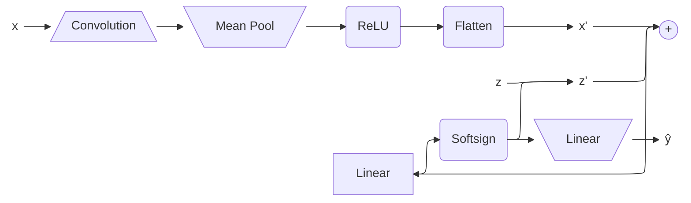

# recurrent-classifier-sonification

```mermaid
---
config:
    layout: elk
    elk:
        mergeEdges: true
        nodePlacementStrategy: NETWORK_SIMPLEX
---
flowchart LR;
    X((x))-->C[/Convolution\]-->M[\Mean Pool/]-->R(ReLU)-->F(Flatten)-->X'((x'))-->P((+));
    Z'((z'))-->P
    Z((z)) --> Z'
    P-->Linear-->S(Softsign)-->Z';
    S-->O[\Linear/]-->Y((ŷ));
    style X fill: none, stroke: none
    style X' fill: none, stroke: none
    style Y fill: none, stroke: none
    style Z fill: none, stroke: none
    style Z' fill: none, stroke: none
```
